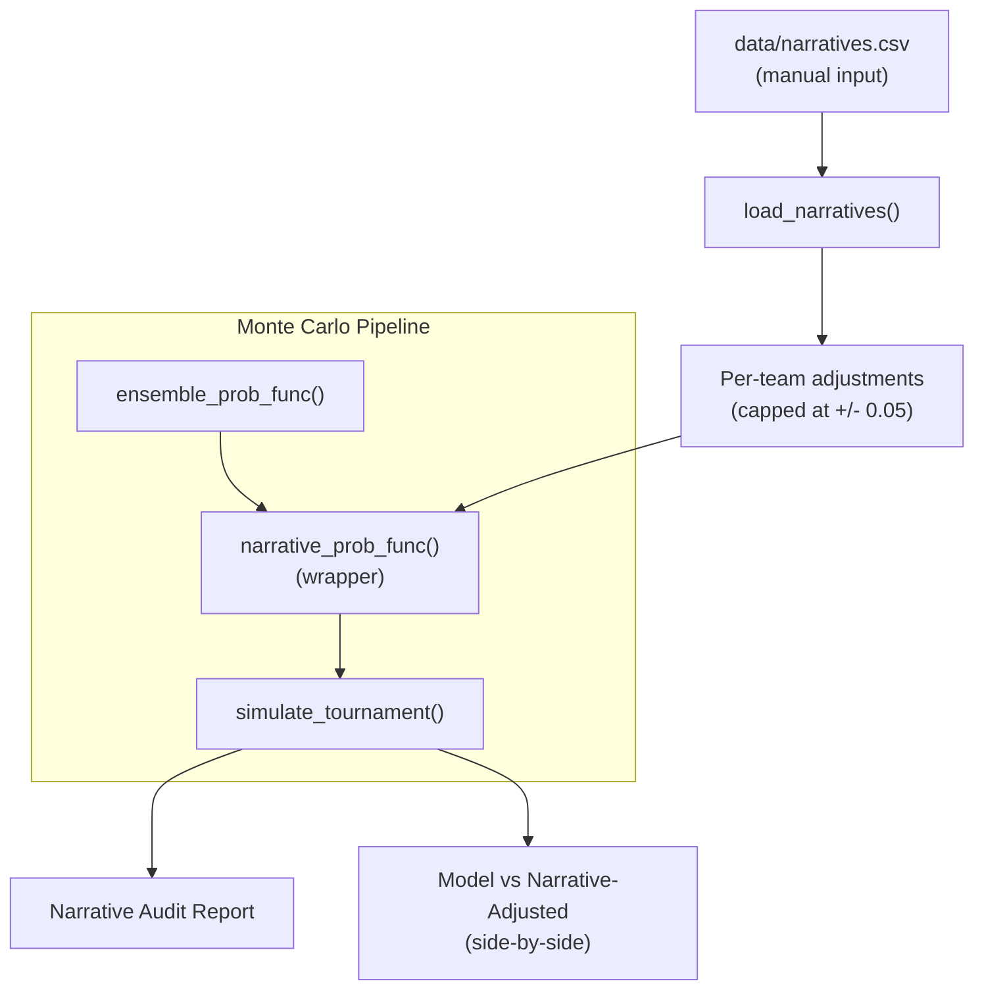

# Narrative Verification Layer

## Architecture

The narrative layer is a **thin wrapper** around the existing ensemble prob_func. It does not modify any upstream model logic. The core model stays clean and unvalidated predictions cannot leak backward.




## Key Design Decisions

- **Probability shifts, not Power Rating multipliers.** The Gemini formula `PR_adj = PR * (1 - sum_risk)` doesn't work with our probability-based ensemble. Instead, each narrative factor maps to an additive probability shift (e.g., -0.03 on team A's win probability).
- **Per-team, not per-matchup.** You assign adjustments to teams (e.g., "Texas Tech: -0.04"). The wrapper converts these to matchup-level shifts: if A has -0.04 penalty and B has +0.02 bonus, A's win prob shifts by `-(0.04 + 0.02) / 2 = -0.03`.
- **Injury-aware capping.** If the injury model already penalizes a team, the narrative layer's "personnel_loss" factor is reduced by the injury model's existing penalty (prevents double-counting). Maximum narrative adjustment for a team with an active injury penalty = 2% instead of 5%.
- **Toggleable via `DATASET_CONFIG["use_narrative_layer"]`** (default: `False`). When off, zero code paths are affected.
- **Not backtested.** This is documented as a "2026-only qualitative overlay" with no historical validation. The 73.7% accuracy metric refers to the core model only.

## File Changes

### 1. New file: [src/narrative_layer.py](src/narrative_layer.py)

Core module with ~150 lines:

- `load_narratives() -> Dict[str, TeamNarrative]` — reads `data/narratives.csv`, validates schema, returns per-team narrative adjustments.
- `TeamNarrative` dataclass: holds `team_name`, list of `NarrativeFactor`s (each with `factor_type`, `direction`, `magnitude`, `confidence`, `notes`), and computed `total_adjustment` (capped at 0.05).
- `build_narrative_prob_func(base_func, narratives, injury_profiles) -> Callable` — wraps the base ensemble prob_func. For each matchup:
  1. Get base probability from `base_func(team_a, team_b)`
  2. Look up narrative adjustments for both teams
  3. If a team has a "personnel_loss" factor AND an active injury profile, reduce the narrative factor by 50% (prevents double-count)
  4. Compute net shift: `shift = (adj_b - adj_a)` (positive shift favors team_a)
  5. Apply: `p_adjusted = clip(p_base + shift, 0.02, 0.98)`
- `narrative_audit_report(narratives, matchups, base_probs, adjusted_probs) -> str` — formatted report showing:
  - Each team's narrative factors and total adjustment
  - Matchups where narrative shifts probability by >3% ("Conflict Delta")
  - Matchups where narrative FLIPS the predicted winner
  - Comparison table: Model probability vs Narrative-adjusted probability

### 2. New file: [data/narratives.csv](data/narratives.csv)

CSV schema:

```
team,factor_type,direction,magnitude,confidence,notes
```

- `team`: canonical team name (matching `Team.name`)
- `factor_type`: one of `personnel_loss`, `tactical_counter`, `momentum`, `coach_history`, `public_bias`, `other`
- `direction`: `penalty` or `bonus`
- `magnitude`: 0.01 to 0.05 (the raw probability shift)
- `confidence`: `high`, `medium`, `low` (scales magnitude by 1.0/0.7/0.4)
- `notes`: free-text explanation

Example rows for 2026:

```
Texas Tech,personnel_loss,penalty,0.03,high,"Toppin ACL tear - model already penalizes via injury model but team morale hit not captured"
Louisville,coach_history,penalty,0.02,medium,"Kelsey 0-5 career in tournament"
Miami OH,momentum,bonus,0.02,medium,"31-1 record, Pete Suder 42% from 3"
Akron,tactical_counter,bonus,0.02,medium,"Top-7 offense vs Texas Tech missing defensive anchor"
Florida,public_bias,penalty,0.02,medium,"Weakest 1-seed per KenPom/Barttorvik consensus"
```

### 3. Modified: [src/weights.py](src/weights.py)

Add to `DATASET_CONFIG`:

```python
"use_narrative_layer": False,  # Narrative verification layer (2026-only, not backtested)
```

Add constant:

```python
NARRATIVE_CAP = 0.05  # Max probability shift from narrative layer per team
NARRATIVE_INJURY_OVERLAP_DISCOUNT = 0.50  # Reduce personnel_loss factor by 50% if injury model active
```

### 4. Modified: [src/main.py](src/main.py)

In `main()`, after building `ensemble_prob_func` and before MC simulation (~line 178):

```python
# ── Narrative Verification Layer ──
narrative_data = {}
if DATASET_CONFIG.get("use_narrative_layer", False):
    from src.narrative_layer import load_narratives, build_narrative_prob_func
    narrative_data = load_narratives()
    if narrative_data:
        ensemble_prob_func = build_narrative_prob_func(
            ensemble_prob_func, narrative_data, injury_profiles
        )
        print(f"  Narrative adjustments loaded for {len(narrative_data)} teams")
```

After MC results, print the narrative audit report:

```python
if narrative_data:
    from src.narrative_layer import narrative_audit_report
    print(narrative_audit_report(narrative_data, matchups, ...))
```

### 5. Output: Narrative Audit Report

Printed alongside existing reports. Format:

```
======================================================================
  NARRATIVE VERIFICATION REPORT
  Layer: Manual qualitative overlay (2026 only, not backtested)
  Cap: 5% max probability shift per team
======================================================================

  TEAM ADJUSTMENTS:
  Texas Tech      -3.0%  (personnel_loss: Toppin ACL, -1.5% after injury discount)
                         (tactical_counter vs Akron: -1.5%)
  Louisville      -1.4%  (coach_history: Kelsey 0-5)
  Miami OH        +1.4%  (momentum: 31-1)
  Florida         -1.4%  (public_bias: weakest 1-seed)

  CONFLICT DELTAS (narrative shifts >3%):
  (5) Texas Tech vs (12) Akron
    Model: Texas Tech 61.2%  |  Narrative-adjusted: Texas Tech 55.8%  |  Delta: -5.4%

  WINNER FLIPS (narrative changes predicted winner):
  None

  NOTE: These adjustments are qualitative and not validated against
  historical data. The core model accuracy (73.7%) is unaffected.
======================================================================
```

## What This Layer Does NOT Do

- Does NOT modify team parameters (AdjEM, shooting, etc.) — only shifts final probabilities
- Does NOT affect the optimizer, backtesting, or historical accuracy metrics
- Does NOT scrape any data automatically — all input is manual via CSV
- Does NOT stack with injury model's parameter degradation — it uses a discount to prevent double-counting
- Does NOT change the "Model Only" bracket output — the narrative bracket is produced alongside it

