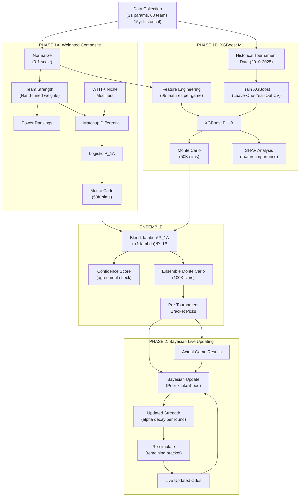

# NCAA 2026 March Madness Champion Predictor

## Round of 64 -- Complete Matchup List (from bracket images)

### EAST Region


| Game                                        | Matchup | Date/Time |
| ------------------------------------------- | ------- | --------- |
| I'm going to adjust weights after the build |         |           |


### EAST Region

- (1) **Duke** vs (16) **Siena** -- 3/19, 2:50 PM
- (8) **Ohio State** vs (9) **TCU** -- 3/19, 12:15 PM
- (5) **St John's** vs (12) **Northern [Iowa/Kentucky?]** -- 3/20, 7:10 PM
- (4) **Kansas** vs (13) **California Baptist** -- 3/20, 3:45 PM
- (6) **Louisville** vs (11) **South Florida** -- 3/19, 1:30 PM
- (3) **Michigan State** vs (14) **North Dakota State** -- 3/19, 4:05 PM
- (7) **UCLA** vs (10) **UCF** -- 3/20, 7:25 PM
- (2) **UConn** vs (15) **Furman** -- 3/20, 10:00 PM

### WEST Region

- (1) **Arizona** vs (16) **Long Island** -- 3/20, 1:35 PM
- (8) **Villanova** vs (9) **Utah State** -- 3/19, 4:10 PM
- (5) **Wisconsin** vs (12) **High Point** -- 3/19, 1:50 PM
- (4) **Arkansas** vs (13) **Hawai'i** -- 3/19, 4:25 PM
- (6) **BYU** vs (11) **TEX/NC [play-in winner]** -- 3/19, 7:25 PM
- (3) **Gonzaga** vs (14) **Kennesaw State** -- 3/19, 10:00 PM
- (7) **Miami** vs (10) **Missouri** -- 3/20, 10:10 PM
- (2) **Purdue** vs (15) **Queens** -- 3/20, 7:35 PM

### SOUTH Region

- (1) **Florida** vs (16) **PV/LEH [play-in winner]** -- 3/20, 9:25 PM
- (8) **Clemson** vs (9) **Iowa** -- 3/20, 6:50 PM
- (5) **Vanderbilt** vs (12) **McNeese** -- 3/19, 3:15 PM
- (4) **Nebraska** vs (13) **Troy** -- 3/19, 12:40 PM
- (6) **North Carolina** vs (11) **VCU** -- 3/19, 6:50 PM
- (3) **Illinois** vs (14) **Penn** -- 3/19, 9:25 PM
- (7) **Saint Mary's** vs (10) **Texas A&M** -- 3/19, 7:35 PM
- (2) **Houston** vs (15) **Idaho** -- 3/19, 10:10 PM

### MIDWEST Region

- (1) **Michigan** vs (16) **UMBC/[play-in winner]** -- 3/19, 7:10 PM
- (8) **Georgia** vs (9) **Saint Louis** -- 3/19, 9:45 PM
- (5) **Texas Tech** vs (12) **Akron** -- 3/20, 12:40 PM
- (4) **Alabama** vs (13) **Hofstra** -- 3/20, 3:15 PM
- (6) **Tennessee** vs (11) **M-OH/[play-in winner]** -- 3/20, 4:25 PM
- (3) **Virginia** vs (14) **Wright State** -- 3/20, 1:50 PM
- (7) **Kentucky** vs (10) **Santa Clara** -- 3/20, 12:15 PM
- (2) **Iowa State** vs (15) **Tennessee [State/Tech?]** -- 3/20, 2:50 PM

**NOTE:** Some team names are truncated in the bracket. Need confirmation on: Northern Iowa or Northern Kentucky (East 12-seed), the four play-in matchups (TEX/NC, PV/LEH, UMBC/?, M-OH/S?), and the Iowa State 15-seed opponent.

---

## Parameter Framework -- The Brain of the Algorithm

### Tier 1: MUST-HAVE Parameters (Highest Predictive Power)

These are the core engine. Historical analysis shows these are the strongest predictors of March Madness success:

**1. Adjusted Efficiency Margin (AdjEM)** -- *MY TOP ADDITION*

- `AdjEM = AdjO - AdjD`
- AdjO = Points scored per 100 possessions, adjusted for opponent quality
- AdjD = Points allowed per 100 possessions, adjusted for opponent quality
- This is THE single best predictor of tournament success. KenPom has built an empire on this.
- **Suggested weight: 20-25%**

**2. True Shooting Percentage (TS%)** -- *YOUR suggestion, excellent*

- `TS% = PTS / (2 x (FGA + 0.44 x FTA))`
- Captures scoring efficiency accounting for free throws AND three-pointers
- Better than raw FG% because it values efficient scoring
- **Suggested weight: 8-10%**

**3. Strength of Schedule (SOS)** -- *MY ADDITION*

- `SOS = Average(Opponent_AdjEM) across all games`
- A 28-4 team from the Big East is NOT the same as 28-4 from the Patriot League
- Critical for evaluating mid-majors vs power conference teams
- **Suggested weight: 10-12%**

**4. Turnover Rate (TO%)** -- *MY ADDITION*

- `TO% = Turnovers / Possessions`
- March games are tighter, turnovers are magnified. Teams that protect the ball survive.
- **Suggested weight: 7-8%**

**5. Clutch Factor (CF)** -- *YOUR suggestion, REVISED formula*

- OLD formula had small-sample problems (few games with trailing <2min situations)
- PRIMARY: `CF = Win% in games decided by 5 points or fewer`
- SECONDARY: `ClutchNet = Net Rating in final 5 minutes of games within 10 points`
- Combined: `CF = 0.6 x CloseGameWin% + 0.4 x norm(ClutchNet)`
- Larger sample size = more reliable signal
- **Suggested weight: 6-7%**

**6. Three-Point Reliability Index (3PRI)** -- *YOUR suggestion, enhanced*

- `3PRI = 3P% x (3PA / FGA)`
- Not just accuracy -- combines volume AND accuracy
- A team shooting 40% on 5 attempts/game is less dangerous than 36% on 25 attempts/game
- **Suggested weight: 6-8%**

**7. Offensive Rebound Rate (ORB%)** -- *YOUR suggestion*

- `ORB% = Off_Rebounds / (Off_Rebounds + Opp_Def_Rebounds)`
- Second-chance points are HUGE in tournament play when defenses tighten
- **Suggested weight: 4-5%**

**8. Effective Field Goal Percentage (eFG%)** -- *NEW, Dean Oliver's Four Factors*

- `eFG% = (FGM + 0.5 x 3PM) / FGA`
- One of the Four Factors of Basketball. Accounts for extra value of threes.
- Used heavily in KenPom. One of the top predictors of winning any single game.
- **Suggested weight: 6-8%**

**9. Seed Strength Adjustment (SEED)** -- *NEW, Committee Intelligence*

- `SeedScore = 1 / Seed`
- Seeds encode committee evaluation: injuries, late-season form, eye test, resume
- Most top Kaggle models still include seed because it captures information no single stat does
- **Suggested weight: 5-6%**

**10. Opponent Adjusted Efficiency / Top-50 Performance (T50)** -- *NEW*

- `T50 = Win% vs Top 50 AdjEM teams`
- Many teams dominate weak schedules and collapse vs elite opponents
- This exposes frauds that SOS alone cannot catch
- **Suggested weight: 5-6%**

### Tier 2: STRONG Parameters (High Predictive Value)

**11. Free Throw Reliability (FTR)** -- *MY ADDITION*

- `FTR = FT% x (FTA / FGA)`
- Games come down to free throws. Combines ability to GET to the line with making them.
- **Suggested weight: 5-6%**

**12. Assist Rate (AST%)** -- *YOUR suggestion*

- `AST% = Assists / Field_Goals_Made`
- Ball movement = team cohesion = less likely to crumble under pressure
- **Suggested weight: 4-5%**

**13. Star Power Index (SPI)** -- *YOUR suggestion, REVISED formula*

- OLD formula (TS% x Usage) could reward inefficient high-usage players
- NEW: `SPI = (Player_BPM x Usage%) / League_Average_BPM`
- BPM (Box Plus/Minus) captures total impact, not just scoring
- Alternative inputs: PER or Win Shares can substitute for BPM
- SPI > 1.5 = superstar carry potential
- **Suggested weight: 6-8%**

**14. Experience Factor (EXP)** -- *MY ADDITION*

- `EXP = Sum(Minutes_Played x Years_In_College) / Total_Minutes`
- Freshmen-heavy teams historically UNDERPERFORM their seed by ~1.5 seeds
- Tournament experience specifically (returning players who played in last year's tourney)
- **Suggested weight: 5-6%**

**15. Defensive Versatility Index (DVI)** -- *MY ADDITION*

- `DVI = w1(BLK/game) + w2(STL/game) + w3(1 - Opp_3P%)`
- Can they guard the 3? Can they protect the rim? Can they create turnovers?
- **Suggested weight: 3-4%**

**16. Defensive Rebound Rate (DRB%)** -- *NEW*

- `DRB% = DefReb / (DefReb + Opp_OffReb)`
- Tournament games are LOW possession games. Giving up second chances kills you.
- Complements ORB% -- you had offense but not the defensive side of the glass
- **Suggested weight: 4-5%**

**17. Turnover Forcing Rate (OppTO%)** -- *NEW, defensive turnovers*

- `OppTO% = Opponent_Turnovers / Opponent_Possessions`
- You had offensive TO% but not the defensive side
- Teams like Houston historically dominate this -- their press creates chaos
- **Suggested weight: 4-5%**

**18. Rim Protection Index (RPI_rim)** -- *NEW*

- `RPI_rim = BLK% + (1 - Opp_FG%_at_rim)`
- Blocks alone are noisy. This combines shot-blocking with actual rim deterrence
- A team can protect the rim without blocking shots (altered shots, deterrence)
- **Suggested weight: 3-4%**

### Tier 3: VALUABLE but Secondary Parameters

**19. Momentum / Hot Streak (MOM)**

- `MOM = 0.6 x (Last_10_Win%) + 0.4 x (Conf_Tournament_Result_Score)`
- Teams peaking at the right time (see: 2023 UConn, 2024 UConn)
- **Suggested weight: 2-3%**

**20. Coaching Tournament Factor (CTF)** -- *MY ADDITION*

- `CTF = (Coach_Tourney_Wins + 2) / (Coach_Tourney_Games + 4)` (Bayesian smoothing)
- Coaches like Izzo, Self, Few consistently outperform. Inexperienced tourney coaches underperform.
- **Suggested weight: 2-3%**

**21. Rebounding Margin (RBM)**

- `RBM = (Team_Total_Rebounds - Opp_Total_Rebounds) / Games`
- Board dominance = more possessions = more chances
- **Suggested weight: 2-3%**

**22. 1st Half Scoring Dominance (Q1)** -- *YOUR suggestion, NEW*

- `Q1_Score = Avg_1st_half_points - Opp_Avg_1st_half_points`
- Teams that come out strong set the tone. Fast starters force opponents into uncomfortable catch-up mode.
- In March, falling behind early against a disciplined team is often fatal.
- **Suggested weight: 2-3%**

**23. 2nd Half Scoring / 3rd Quarter Surge (Q3)** -- *YOUR suggestion, NEW*

- `Q3_Score = Avg_2nd_half_points - Opp_Avg_2nd_half_points`
- Halftime adjustments matter. Teams that come out of the locker room stronger show coaching adaptability.
- The "third quarter" (first 10 min of 2nd half in college) is where great coaches separate from good ones.
- **Suggested weight: 2-3%**

**24. Legacy Factor (LF)** -- *YOUR suggestion, REVISED*

- OLD formula was brand-biased. NEW formula measures actual overperformance:
- `LF = Historical_Seed_Outperformance` (e.g., Michigan State historically outperforms seed by ~0.8 rounds under Izzo)
- Computed as: average round reached minus expected round reached for seed, over last 15 years
- **Suggested weight: 1-2% MAX** (statistically weak historically, use sparingly)

**25. Bench Depth Score (BDS)**

- `BDS = Bench_Points / Total_Points`
- Foul trouble resilience. Deep teams survive 6-game gauntlets.
- **Suggested weight: 1-2%**

### Tier 4: SITUATIONAL / Lower Priority

**26. Proximity Advantage (PA)** -- *Replaces weather*

- `PA = 1 / (1 + Distance_to_Venue / 500)`
- Weather doesn't matter (indoor arenas). TRAVEL DISTANCE does -- fan support, familiarity, less fatigue.
- **Suggested weight: 1%**

**27. Pace of Play Matchup (PACE)**

- `PACE = Possessions / 40 minutes`
- Not a quality metric on its own, but creates MATCHUP dynamics (fast vs slow = chaos)
- Used as a **volatility modifier** in Monte Carlo, not a direct quality score

### Tier 4B: CONDITIONAL WIN PROBABILITIES (CWP) -- Fragility & Versatility

These measure HOW a team wins, not just how often. Teams that can only win under ideal conditions get EXPOSED in March. All CWPs are computed from game logs (Sports-Reference or CBBpy), then compressed into 2-3 composite scores.

**32. Conditional Win Dependencies (CWD)** -- 14 individual CWPs, combined into composites

**Star/Player Dependencies:**

- CWP-1: `Win% when best player plays 30+ min` vs overall Win% (star minutes → winning, YOUR pick)
- CWP-2: `Win% when best player scores below his season average` (star cold, can others step up?)
- CWP-3: `Win% when best player shoots under 20% FG at halftime` (star nightmare first half -- does the team survive? YOUR pick)
- CWP-4: `Win% when assists >= season average` vs `Win% when assists < average` (ball movement dependency, YOUR pick)

**Shooting/Offensive Dependencies:**

- CWP-5: `Win% when 3P% >= 35%` vs `Win% when 3P% < 30%`
- CWP-6: `Win% when FT rate is below season average`
- CWP-7: `Win% when committing 15+ turnovers`

**Defensive/Adversity Dependencies:**

- CWP-8: `Win% when out-rebounded`
- CWP-9: `Win% when opponent shoots 45%+ FG`
- CWP-10: `Win% when opponent goes on a 10-0+ scoring run`

**Game Flow Dependencies:**

- CWP-11: `Win% when trailing at halftime` (comeback DNA -- can you come back?)
- CWP-12: `Win% when leading at halftime` (closing ability -- can you hold a lead? Confirms Q1 scoring, YOUR pick)
- CWP-13: `Win% vs top-50 AdjEM teams` (overlaps with T50 but conditional format)
- CWP-14: `Win% when shooting under 30% from 3` (can you win when the 3 doesn't fall?)

**Composite Scores (what actually goes into the model):**

```
Fragility_Score = AVG drop in Win% across all adverse conditions
  = AVG(Overall_Win% - CWP_i) for conditions where CWP_i < Overall_Win%
  High = fragile team (needs everything to go right)
  Low = resilient team (wins in many conditions)

Versatility_Score = count of adverse conditions where Win% > 50%
  Out of 14 CWPs, how many can you still win more than lose?
  14/14 = ultimate March team. 6/14 = one bad bounce from going home.

March_Readiness = weighted combo of tournament-critical CWPs
  = 0.25 x CWP_11 (trailing at half -- comeback DNA)
  + 0.20 x CWP_12 (leading at half -- closing ability)
  + 0.20 x CWP_14 (cold from 3 -- survive without the 3)
  + 0.15 x CWP_3  (star shooting <20% at half -- survive star nightmare)
  + 0.10 x CWP_8  (out-rebounded)
  + 0.10 x CWP_9  (opponent hot shooting)
```

- **Why composites, not 14 individual weights?** Small sample sizes. A single CWP may be based on only 4-6 games. Combining 14 CWPs washes out noise and reveals the true signal: is this team fragile or resilient?
- Data source: Sports-Reference game logs (68 teams x ~30 games = ~2,100 game logs to scrape)
- **Suggested weight for Fragility_Score: 3-4%**
- **Suggested weight for March_Readiness: 2-3%**
- Versatility_Score used as a flag/tiebreaker, not directly weighted

### Tier 5: SUPER NICHE -- Low Weight, High Insight

These won't swing predictions alone but capture real basketball phenomena that mainstream models completely ignore. Each is worth ~0.5-1% weight or acts as a tiebreaker/flag.

**28. Jersey Color Aggression (JCA)** -- *NICHE*

- `JCA = Historical_Foul_Rate_in_Dark_Jerseys - Historical_Foul_Rate_in_Light_Jerseys`
- Research (Frank & Gilovich, 1988; later replicated) shows dark-jersey teams are perceived as more aggressive by refs AND actually play more aggressively
- Interacts with RefImpact: dark jersey + whistle-happy ref crew = foul trouble spiral
- Applied as: modifier to personal foul projection in simulation
- **Weight: flag/modifier, not scored directly**

**29. Max Scoring Run Potential (MSRP)** -- *NICHE*

- `MSRP = AVG(Largest_Unanswered_Run_per_game)`
- Teams capable of explosive 12-0, 15-0 runs can erase double-digit deficits in minutes
- The inverse matters too: `Opp_MSRP = AVG(Largest_Run_Allowed_per_game)` -- how often do they let opponents go on runs?
- `Net_Run = MSRP - Opp_MSRP`
- In March, one explosive run decides games. This is the "lightning strike" metric.
- **Suggested weight: 1%**

**30. Blowout Resilience (BR)** -- *NICHE*

- `BR = Games_where_trailed_by_15+_and_cut_to_single_digits / Games_where_trailed_by_15+`
- Mental toughness indicator. Teams that fold when down big have no March ceiling.
- Complementary data point: average deficit recovery per game (how many points do they claw back from max deficit?)
- **Suggested weight: 1%**

**31. Foul Trouble Impact (FTI)** -- *NICHE*

- `FTI = Team_PlusMinus_when_best_player_has_3plus_fouls`
- Measures true depth under the worst-case scenario
- A team that goes -15 when their star sits vs one that goes -2 tells you everything about depth
- Interacts with BDS (Bench Depth) but measures the SPECIFIC impact, not general bench scoring
- **Suggested weight: 1%**

### Parameters SKIPPED or ABSORBED:

- **Weather/Location weather**: NO. Indoor arenas. Replaced with travel distance (PA).
- **Raw win-loss record**: NO. Already captured by AdjEM + SOS.
- **Conference affiliation alone**: NO. Already in SOS.
- **Preseason rankings**: NO. Stale by March.
- **Opponent 3PT Defense (O3PD)**: ABSORBED into DVI (Defensive Versatility Index already includes Opp_3P%).

---

## "What The Hell" (WTH) Layer -- Optional Chaos Modifiers

These parameters live OUTSIDE the main weighted model. They act as **multipliers or flags** that adjust the Monte Carlo simulation variance. They help explain outliers and upsets that pure stats miss.

**WTH-1. Sightline Penalty (Arena Effect)**

- `SightlinePenalty = Historical_3P%_Drop_in_Large_Arena`
- Shooters struggle in NFL-stadium-style venues (Final Four effect)
- Some arenas have notoriously bad depth perception for 3PT shooters
- Applied as: `3PRI_adjusted = 3PRI x (1 - SightlinePenalty)`

**WTH-2. Altitude Impact**

- `AltitudeImpact = (ArenaElevation / 5280) x (3PA / FGA)`
- Teams playing at significantly higher altitude than their home = cardio penalty + shooting inconsistency
- Denver (5,280 ft), Salt Lake City (4,226 ft) venues penalize sea-level teams
- Applied as: stamina modifier in 2nd half scoring projection

**WTH-3. Referee Impact**

- `RefImpact = Team_Foul_Rate x Ref_Crew_Avg_Fouls_Called`
- Some ref crews call 40+ fouls per game. Foul-prone teams in front of whistle-happy crews = disaster.
- Applied as: adjustment to FTR and bench depth importance

**WTH-4. Three-Point Variance (Chaos Index)**

- `Variance_3P = (3PA / FGA) x StdDev(Game_by_Game_3P%)`
- High-variance 3PT teams are WILDCARDS. They can beat anyone or lose to anyone.
- Applied as: **widens the probability distribution** in Monte Carlo (pulls P toward 0.5)
- This is the "ChaosIndex" from the Kaggle architecture

**WTH-5. Sentiment Score (Social Signal)**

- `SentimentScore = PositiveMentions - NegativeMentions` (Twitter/X, Reddit)
- Captures: injury whispers, locker room drama, fan energy, "vibe check"
- VERY noisy, but can flag things stats miss (player illness, suspensions not yet public)
- Applied as: small modifier (+/- 1-2%) to win probability, only when signal is extreme

**WTH-6. Roster Demographic Composition (RDC)** -- *OPTIONAL, manual data*

- `BlackPlayerCount = count of Black players in rotation (top 8-10 minutes)`
- `WhitePlayerCount = count of White players in rotation (top 8-10 minutes)`
- `RDC_ratio = BlackPlayerCount / (BlackPlayerCount + WhitePlayerCount)`
- Hypothesis: roster composition may loosely correlate with recruiting pipeline and team playstyle tendencies (athletic/defensive-leaning vs. shooting/passing-leaning)
- IMPORTANT CAVEATS: This is a crude proxy. Individual player skills vary enormously regardless of race. The playstyle signal is better captured directly by our core stats (Pace, STL rate, BLK%, 3PRI, AST%). Use only as a cross-check, never as a primary driver.
- Data source: Manual classification from roster photos (~68 teams x 10 players). Subjective and time-intensive.
- Applied as: optional flag/cross-reference. Compare RDC_ratio against PSI (Playstyle Index) to see if there is any residual signal not already captured by stats. If the correlation is weak or non-existent, discard.
- **Weight: 0% in main model. WTH-layer cross-check only.**

**WTH-7. Playstyle Index (PSI)** -- *Recommended statistical alternative to WTH-6*

- `PSI = w1*norm(AdjTempo) + w2*norm(STL_rate) + w3*norm(BLK%) + w4*norm(FastBreakPts) - w5*norm(3PA/FGA) - w6*norm(AST%) - w7*norm(HalfCourtEff)`
- PSI > 0 = athletic/defensive/fast team
- PSI < 0 = shooting/passing/halfcourt team
- Captures the same playstyle spectrum using DIRECT PERFORMANCE DATA
- Matchup interaction: high-PSI vs low-PSI creates specific dynamics (pace disruption, style clash)
- Applied as: matchup volatility modifier. Style clashes (large |PSI_A - PSI_B|) increase upset probability.
- **Weight: WTH modifier, not in the 1.00 sum**

---

## Outlier Detection: Undervalued Mid-Major Identifier

Flag teams that meet ALL of these criteria as **potential Cinderella picks**:

- AdjEM rank in top 20 nationally
- Tournament seed >= 6 (underseeded by committee)
- Average roster experience >= 2.0 years
- Clutch Factor (CF) above tournament median

These teams historically outperform their seed. The algorithm will flag them and optionally boost their Monte Carlo ceiling by widening their win probability range upward.

---

## The Probability Equations -- Full Mathematical Framework

### Individual Metric Equations

**Equation 1: True Shooting Percentage**

```
TS% = PTS / (2 x (FGA + 0.44 x FTA))
```

- Measures: Points produced per shooting opportunity
- Range: 0.45 (poor) to 0.65 (elite)
- Why 0.44? Average FT trips yield 0.44 FGA-equivalents

**Equation 2: Adjusted Offensive Efficiency**

```
AdjO = (PTS_scored / Possessions) x 100 x (Avg_Def_Eff / Opp_Def_Eff)
```

- Measures: Points per 100 possessions, adjusted so a team playing all weak defenses gets penalized
- Range: ~95 (poor) to ~125 (elite)

**Equation 3: Adjusted Defensive Efficiency**

```
AdjD = (PTS_allowed / Possessions) x 100 x (Avg_Off_Eff / Opp_Off_Eff)
```

- Measures: Points allowed per 100 possessions, adjusted for opponent quality
- Range: ~125 (terrible) to ~88 (elite). LOWER = BETTER.

**Equation 4: Possessions Estimate**

```
Possessions = FGA - ORB + TO + (0.475 x FTA)
```

- Standard possession estimator used across all efficiency metrics

**Equation 5: Offensive Rebound Rate**

```
ORB% = ORB / (ORB + Opp_DRB)
```

- Measures: What fraction of available offensive rebounds does the team grab?
- Range: 20% (poor) to 38% (elite)

**Equation 6: Clutch Factor (REVISED)**

```
CF = 0.6 x (Wins_in_games_decided_by_5_or_fewer / Total_such_games)
   + 0.4 x norm(NetRating_final_5min_in_close_games)
```

- Measures: Ability to WIN in close games (not just trail-and-recover)
- Uses games decided by <=5 points for larger sample size than "trailing under 2 min"
- ClutchNet component captures net rating in crunch time of competitive games
- Range: 0.0 (always loses close ones) to 1.0 (ice cold closer)

**Equation 7: Three-Point Reliability Index**

```
3PRI = 3P% x (3PA / FGA)
```

- Measures: Combined three-point accuracy AND dependence
- A team with 3PRI = 0.14 is more three-point dangerous than one at 0.08

**Equation 8: Assist Rate**

```
AST% = AST / FGM
```

- Measures: What percentage of made baskets came off assists (team ball)
- Range: 40% (iso-heavy) to 65% (elite ball movement)

**Equation 9: Turnover Rate**

```
TO% = TO / (FGA + 0.475 x FTA + TO)
```

- Measures: What fraction of possessions end in a turnover
- Range: 12% (elite protection) to 22% (careless)

**Equation 10: Free Throw Reliability**

```
FTR = FT% x (FTA / FGA)
```

- Measures: Combined free throw production (getting there + making them)

**Equation 11: Star Power Index (REVISED)**

```
SPI = (Player_BPM x Player_Usage%) / League_Avg_BPM
where:
  BPM = Box Plus/Minus (captures total impact: scoring, rebounding, assists, defense)
  Usage% = (FGA + 0.44*FTA + TO) / (Team_Possessions x (Player_Min / Team_Min))
  Alternative: replace BPM with PER or Win_Shares/40
```

- Measures: Total impact of best player relative to his usage volume
- BPM is superior to TS% alone because it captures defense and playmaking
- SPI > 1.5 = superstar carry potential

**Equation 12: Experience Factor**

```
EXP = SUM(Player_Minutes x Player_Year) / SUM(Player_Minutes)
where Player_Year: FR=1, SO=2, JR=3, SR=4, Grad=5
```

- Measures: Minutes-weighted maturity of the roster
- EXP > 3.0 = very experienced, EXP < 2.0 = dangerously young

**Equation 13: Strength of Schedule**

```
SOS = AVG(Opponent_AdjEM) for all regular season games
```

- Measures: Average quality of opponents faced

**Equation 14: Coaching Factor**

```
CTF = (Coach_Tourney_Wins + 2) / (Coach_Tourney_Games + 4)  [Bayesian smoothing]
```

- Bayesian smoothing prevents new coaches from having extreme values
- Regresses toward 0.5 (coin flip) with limited data

**Equation 15: Momentum**

```
MOM = 0.6 x (Wins_Last10 / 10) + 0.4 x (ConfTourney_Score)
where ConfTourney_Score: Champion=1.0, Finals=0.75, Semis=0.5, Quarters=0.3, Early_Exit=0.1
```

**Equation 16: Legacy Factor (REVISED)**

```
LF = Historical_Seed_Outperformance
   = AVG(Actual_Round_Reached - Expected_Round_for_Seed) over last 15 years
Example: MSU averages reaching 0.8 rounds deeper than their seed predicts under Izzo
```

**Equation 17: Proximity Advantage**

```
PA = 1 / (1 + (Distance_miles / 500))
```

- At 0 miles: PA = 1.0 (max). At 500 miles: PA = 0.5. At 2000 miles: PA = 0.2.

**Equation 18: Defensive Versatility**

```
DVI = 0.3 x norm(BLK/g) + 0.3 x norm(STL/g) + 0.4 x norm(1 - Opp_3P%)
```

- Normalized (norm) = (value - min) / (max - min) across all tournament teams

**Equation 19: Bench Depth**

```
BDS = Bench_Points / Total_Points
```

**Equation 20: Effective Field Goal Percentage**

```
eFG% = (FGM + 0.5 x 3PM) / FGA
```

- One of Dean Oliver's Four Factors of Basketball
- Rewards 3-point shooting by giving it 50% bonus value
- Range: 0.42 (poor) to 0.58 (elite)

**Equation 21: Defensive Rebound Rate**

```
DRB% = DefReb / (DefReb + Opp_OffReb)
```

- Measures: What fraction of defensive rebounds does the team secure?
- Prevents second-chance points. Critical in low-possession tournament games.
- Range: 65% (poor) to 80% (elite)

**Equation 22: Seed Score**

```
SeedScore = 1 / Seed
```

- 1-seed = 1.0, 2-seed = 0.5, 4-seed = 0.25, 16-seed = 0.0625
- Encodes committee intelligence: resume, eye test, injuries, late-season form

**Equation 23: Top-50 Performance**

```
T50 = Wins_vs_Top50_AdjEM / Games_vs_Top50_AdjEM
```

- Measures: Win rate specifically against elite competition
- Exposes teams that pad records against weak schedules

**Equation 24: Turnover Forcing Rate (Defensive)**

```
OppTO% = Opponent_Turnovers / Opponent_Possessions
```

- Defensive counterpart to TO% (Eq. 9)
- Pressure defense creates live-ball turnovers = easy transition points

**Equation 25: Rim Protection Index**

```
RPI_rim = norm(BLK%) + norm(1 - Opp_FG%_at_rim)
```

- Combines shot-blocking rate with actual rim deterrence
- A team can protect the rim without blocking (altered shots, deterrence effect)

**Equation 26: 1st Half Scoring Dominance**

```
Q1_Score = AVG(Team_1st_Half_Points) - AVG(Opp_1st_Half_Points)
```

- Measures: Ability to come out strong and control early tempo

**Equation 27: 2nd Half / 3rd Quarter Surge**

```
Q3_Score = AVG(Team_2nd_Half_Points) - AVG(Opp_2nd_Half_Points)
```

- Measures: Halftime adjustment quality and finishing strength

**Equation 28: Three-Point Variance (Chaos Index)**

```
ChaosIndex = (3PA / FGA) x StdDev(Game_by_Game_3P%)
```

- High ChaosIndex = wildcard team. Used as volatility modifier in Monte Carlo.
- Widens win probability distribution (pulls toward 50%)

**Equation 29: Sightline Penalty**

```
SightlinePenalty = Historical_3P%_Drop_in_Large_Arena_Format
3PRI_adjusted = 3PRI x (1 - SightlinePenalty)
```

**Equation 30: Altitude Impact**

```
AltitudeImpact = (ArenaElevation / 5280) x (3PA / FGA)
```

- Applied as stamina modifier to 2nd-half projections

**Equation 31: Referee Impact**

```
RefImpact = Team_Foul_Rate x Ref_Crew_Avg_Fouls_Per_Game
```

- Adjusts FTR and bench depth importance dynamically

**Equation 32: Sentiment Score**

```
SentimentScore = Normalized(PositiveMentions - NegativeMentions)
```

- Social media signal. Only applied when extreme outlier detected.

**Equation 33: Jersey Color Aggression**

```
JCA = Foul_Rate_in_Dark_Jerseys - Foul_Rate_in_Light_Jerseys (historical, per team)
FoulProjection_adjusted = BaseFoulRate x (1 + JCA_modifier x IsWearingDark)
```

- Dark jersey teams historically called for ~0.5-1.0 more fouls/game
- Applied as foul projection modifier, interacts with RefImpact

**Equation 34: Max Scoring Run Potential**

```
MSRP = AVG(Max_Unanswered_Run) across all games
Opp_MSRP = AVG(Max_Run_Allowed) across all games
Net_Run = MSRP - Opp_MSRP
```

- Measures explosive scoring capability vs defensive composure
- Net_Run > 4.0 = team can flip any game with one burst

**Equation 35: Blowout Resilience**

```
BR = Count(Games trailing 15+ that were cut to single digits) / Count(Games trailing 15+)
```

- BR > 0.6 = mentally tough team that never quits
- BR < 0.2 = team folds under pressure -- March death sentence

**Equation 36: Foul Trouble Impact**

```
FTI = Team_PlusMinus_with_star_3plus_fouls / Minutes_with_star_3plus_fouls
     compared to
     Team_PlusMinus_with_star_on_court / Minutes_with_star_on_court
```

- Difference shows how dependent the team is on their best player
- Large negative gap = fragile team. Near-zero gap = deep and resilient.

**Equation 37: Conditional Win Probabilities (CWP)**

```
For each team, for each of 14 conditions:
  CWP_i = Wins_when_condition_i_met / Games_when_condition_i_met

Fragility_Score = AVG(Overall_Win% - CWP_i) for all adverse-condition CWPs
  Range: 0.0 (bulletproof) to 0.5 (house of cards)

Versatility_Score = COUNT(CWP_i > 0.50) / 14
  Range: 0.0 (can only win one way) to 1.0 (wins in every situation)

March_Readiness = 0.30*CWP_trailing_at_half
               + 0.25*CWP_neutral_court
               + 0.20*CWP_cold_from_3
               + 0.15*CWP_out_rebounded
               + 0.10*CWP_opponent_hot
```

- Fragility and March_Readiness enter the main model as weighted parameters
- Versatility_Score is a flag/tiebreaker, not directly weighted
- Computed from ~30 game logs per team (Sports-Reference or CBBpy scrape)

---

### The Master Equation: Head-to-Head Win Probability

---

## PHASE 1A: Weighted Composite + Logistic + Monte Carlo

The interpretable, hand-tuned engine. You understand exactly WHY every prediction is made. Every weight is a knob you can turn.

### 1A-Step 1: Team Strength Score

**Equation 38: Team Strength Composite**

```
TeamStrength_1A = w1*AdjEM + w2*ShootingScore + w3*DefenseScore + w4*Experience + w5*Clutch
               + w6*CWD_Fragility + w7*CWD_MarchReadiness + ...
where:
  ShootingScore = weighted combination of TS%, eFG%, 3PRI, FTR
  DefenseScore = weighted combination of AdjD, DRB%, OppTO%, RPI_rim, DVI
  NicheScore = weighted combination of MSRP, BR, FTI (low weight, high insight)
```

- All 31 core + niche parameters feed into a single TeamStrength score per team
- This produces the **Power Rankings** (rank all 68 teams)
- Fully interpretable: "Duke is #3 because they're elite in AdjEM but weak in clutch"

### 1A-Step 2: Head-to-Head Matchup

**Equation 39: Composite Score Differential**

```
z = SUM(wi x (norm(Param_i_TeamA) - norm(Param_i_TeamB)))  for i = 1..N parameters
```

Where `wi` are the weights (summing to 1.0), and `norm()` normalizes each parameter to [0, 1] across all 68 teams.

**Equation 40: Win Probability (Logistic Function)**

```
P_1A(A beats B) = 1 / (1 + e^(-k x z))
```

Where:

- `z` = composite score differential from Eq. 38
- `k` = scaling constant calibrated to reproduce historical seed-based win rates (typically k ~ 5-8)
- Output: probability between 0 and 1

**Equation 41: Upset Volatility Modifier (ChaosIndex + Niche Integration)**

```
P_1A_adjusted(A beats B) = P_1A(A beats B) x (1 - V) + 0.5 x V
where:
  V = ChaosIndex_combined
  V = 0.15 x (ChaosIndex_A + ChaosIndex_B) / 2
    + 0.05 x |PACE_A - PACE_B| / max_pace_diff
    + JCA_modifier (if dark jersey matchup)
    + WTH_adjustments (sightline, altitude, ref, sentiment -- when applicable)
```

### 1A-Step 3: Monte Carlo Simulation

**Equation 41: Single Game Simulation**

```
For each matchup:
  1. Compute P_1A_adjusted(A beats B) using Eq. 40
  2. Draw random number r ~ Uniform(0, 1)
  3. If r < P_1A_adjusted: A wins. Else: B wins.
```

**Equation 42: Full Tournament Simulation**

```
For sim = 1 to N_simulations (50,000):
  Simulate all 63 games (R64 -> R32 -> S16 -> E8 -> F4 -> Championship)
  Record: champion, Final Four, Elite Eight, all results
```

**Equation 43: Phase 1A Championship Probability**

```
P_1A(Team X = Champion) = Count(Team X won championship) / N_simulations
```

**Equation 44: Round-by-Round Advancement**

```
P_1A(Team X reaches Round R) = Count(Team X reached Round R) / N_simulations
```

**Equation 45: Cinderella Detection**

```
If team has: AdjEM_rank < 20 AND Seed >= 6 AND EXP >= 2.0 AND CF > median
  -> Flag as Cinderella, widen win probability ceiling in Monte Carlo
```

---

## PHASE 1B: XGBoost / ML Pipeline

The data-driven engine. Learns patterns from historical tournaments that humans might miss. Less interpretable but potentially more accurate at finding non-linear interactions between parameters.

### 1B-Step 1: Historical Training Data

**Equation 46: Feature Engineering for ML**

```
For each historical tournament game (2010-2025, ~1000 games):
  Features_game = [
    Seed_diff,
    AdjEM_A, AdjEM_B, AdjEM_diff,
    eFG%_A, eFG%_B, eFG%_diff,
    TS%_A, TS%_B, TS%_diff,
    ... (all 31 params as individual + differential features)
    ChaosIndex_A, ChaosIndex_B,
    MSRP_A, MSRP_B, MSRP_diff,
    BR_A, BR_B,
    FTI_A, FTI_B
  ]
  Target = 1 if Team A won, 0 if Team B won
```

- Each game produces ~95 features (31 params x 3 views: Team A raw, Team B raw, differential)
- ~1000 training samples from 15 years of tournaments (63 games x 15 years)
- Additional features: round number, region, historical seed matchup win rates

### 1B-Step 2: XGBoost Model

**Equation 47: XGBoost Win Probability**

```
P_1B(A beats B) = XGBoost.predict_proba(Features_game)
where:
  XGBoost trained with:
    n_estimators = 500-1000
    max_depth = 4-6 (prevent overfitting on ~1000 samples)
    learning_rate = 0.05
    subsample = 0.8
    colsample_bytree = 0.7
    eval_metric = 'logloss'
    early_stopping_rounds = 50
  Cross-validation: Leave-One-Year-Out (train on 14 years, test on 1, rotate)
```

- XGBoost automatically discovers non-linear interactions (e.g., "high 3PRI + low experience = upset risk")
- Feature importance scores reveal which parameters ML thinks matter most vs our hand-tuned weights
- Leave-One-Year-Out CV prevents data leakage and gives honest accuracy estimates

### 1B-Step 3: ML-Augmented Monte Carlo

**Equation 48: Phase 1B Monte Carlo**

```
For each matchup:
  P_1B_adjusted = P_1B(A beats B)  [XGBoost already captures non-linearities, no V needed]
For sim = 1 to 50,000:
  Simulate full bracket using P_1B_adjusted for each game
```

**Equation 49: Phase 1B Championship Probability**

```
P_1B(Team X = Champion) = Count(Team X won championship) / N_simulations
```

### 1B-Step 4: Feature Importance Analysis

**Equation 50: SHAP Values**

```
SHAP_i = contribution of feature i to shifting prediction from base rate
For each matchup:
  Explain WHY XGBoost picked this winner using SHAP waterfall plots
```

- SHAP makes the black box interpretable
- Compare SHAP importance rankings vs our hand-tuned Tier 1/2/3 weights
- If XGBoost says "FTI matters 5x more than we weighted it" -- that is actionable intel

---

## PHASE 1 ENSEMBLE: Blending 1A and 1B

**Equation 51: Ensemble Win Probability**

```
P_ensemble(A beats B) = lambda x P_1A_adjusted + (1 - lambda) x P_1B_adjusted
where:
  lambda = blending weight (start at 0.5, calibrate based on backtesting)
  If 1A and 1B agree: high confidence pick
  If 1A and 1B disagree: flag as UNCERTAIN -- potential upset alert
```

**Equation 52: Confidence Score**

```
Confidence = 1 - |P_1A - P_1B|
```

- When both engines agree (Confidence > 0.9): LOCK IT IN
- When they disagree (Confidence < 0.7): the game is genuinely unpredictable -- flag it
- The disagreement cases are often the most interesting picks

**Equation 53: Ensemble Monte Carlo**

```
For sim = 1 to 100,000:
  For each game: use P_ensemble
  Simulate full bracket
P_final(Champion) = Count / N_simulations
```

---

## PHASE 2: Live Bayesian Updating (Applies to BOTH 1A and 1B)

Once Round of 64 games start, we shift from prediction to UPDATING. Both engines get updated with real results.

**Equation 54: Bayesian Prior (Dual Source)**

```
Prior_1A(Team X) = TeamStrength_1A from Phase 1A (Eq. 37)
Prior_1B(Team X) = XGBoost_predicted_strength from Phase 1B
Prior_ensemble(Team X) = lambda x Prior_1A + (1-lambda) x Prior_1B
```

**Equation 55: Likelihood from Observed Game**

```
L(data | TeamStrength) = P(observed_margin | TeamStrength_A, TeamStrength_B)
Modeled as: Normal(predicted_margin, sigma)
where:
  predicted_margin = k x (TeamStrength_A - TeamStrength_B)
  sigma = tournament_game_variance (~11 points historically)
```

- If Duke beats Siena by 25: expected, low information gain
- If a 12-seed beats a 5-seed by 15: MASSIVE new information, large update

**Equation 56: Posterior Update**

```
TeamStrength_updated = alpha x TeamStrength_prior + (1-alpha) x ObservedPerformance
where alpha decays each round:
  R64: alpha = 0.85 (trust the model)
  R32: alpha = 0.75
  S16: alpha = 0.65
  E8:  alpha = 0.55
  F4:  alpha = 0.45 (trust the games)
```

- Both 1A and 1B priors get updated with the same observed data
- Their posteriors may converge (models were both right) or diverge (one model was wrong)

**Equation 57: XGBoost Re-training (Optional, 1B only)**

```
After Round of 64:
  Add 32 new data points to training set (this year's R64 results)
  Re-train XGBoost with expanded dataset
  Compare re-trained predictions vs original for remaining rounds
```

- Gives XGBoost access to THIS tournament's specific patterns
- Risky with only 32 new samples but can reveal shifts

**Equation 58: Re-simulation**

```
After Round R completes:
  1. Update all surviving teams via Eq. 56 (both 1A and 1B tracks)
  2. Re-run ensemble Monte Carlo (100K sims) for remaining bracket
  3. Output: updated championship odds, new upset alerts, confidence shifts
```

This gives you a LIVING bracket from TWO independent brains that gets smarter as games happen.

---

## Architecture




## Implementation Plan (Python / Jupyter Notebook)

### File Structure

```
NCAA2026_mArchMadness/              <-- PRIVATE GITHUB REPO
  .gitignore
  README.md
  requirements.txt
  data/
    teams_2026.csv                  (all 68 teams + 31 parameters for 2026)
    matchups.csv                    (Round of 64 pairings)
    venues.csv                      (game locations + distances + elevation)
    wth_data.csv                    (WTH layer: sightlines, refs, sentiment)
    niche_data.csv                  (jersey colors, scoring runs, resilience, foul trouble)
    historical/                     (Phase 1B: training data for XGBoost)
      tournament_games_2010_2025.csv
      team_stats_by_year.csv
    live_results/                   (Phase 2: actual game results for Bayesian updates)
      round_of_64.csv
      round_of_32.csv
      sweet_16.csv
      elite_8.csv
      final_4.csv
  notebooks/
    01_data_collection.ipynb
    02_parameter_analysis.ipynb
    03a_composite_model.ipynb       (Phase 1A: weighted composite + logistic)
    03b_xgboost_model.ipynb         (Phase 1B: XGBoost training + SHAP analysis)
    04_ensemble_monte_carlo.ipynb   (Blend 1A+1B, run 100K sims)
    05_results_dashboard.ipynb
    06_bayesian_live.ipynb          (Phase 2: live updating during tournament)
  src/
    models.py                       (Team, Matchup classes)
    equations.py                    (all 58 equations: core + niche + WTH + ML + Bayesian)
    composite.py                    (Phase 1A: weighted composite engine)
    xgboost_model.py                (Phase 1B: XGBoost pipeline + SHAP)
    ensemble.py                     (Blend 1A + 1B, confidence scoring)
    monte_carlo.py                  (simulation engine, shared by all phases)
    bayesian.py                     (Phase 2: live Bayesian updater)
    weights.py                      (parameter weights config + dataset toggles)
    wth_layer.py                    (WTH chaos modifiers)
    niche.py                        (jersey, runs, resilience, foul trouble)
    cinderella.py                   (undervalued mid-major detector)
    utils.py                        (normalization, helpers)
```

### Weight Configuration (starting point, all tunable)

**Tier 1 -- Core Engine (62%)**

- AdjEM: 0.15
- eFG%: 0.07
- TS%: 0.05
- Clutch Factor: 0.06
- SOS: 0.06
- TO% (offensive): 0.05
- 3PRI: 0.05
- ORB%: 0.04
- Seed Score: 0.05
- Top-50 Performance: 0.04

**Tier 2 -- Strong (22%)**

- FTR: 0.04
- AST%: 0.03
- SPI (Star Power): 0.06
- EXP: 0.04
- DVI: 0.03
- DRB%: 0.04
- OppTO%: 0.04
- RPI_rim: 0.03

**Tier 3 -- Secondary (8%)**

- MOM: 0.02
- CTF: 0.02
- RBM: 0.01
- Q1 Scoring: 0.01
- Q3 Scoring: 0.01
- LF (Legacy): 0.01

**Tier 4 -- Conditional Win Dependencies (6%)**

- Fragility Score: 0.03
- March Readiness: 0.02
- (Versatility Score: flag/tiebreaker, 0% direct weight)
- BDS: 0.01

**Tier 4B -- Situational (1%)**

- PA (Proximity): 0.01

**Tier 5 -- Super Niche (3%)**

- MSRP (Scoring Runs): 0.01
- BR (Blowout Resilience): 0.01
- FTI (Foul Trouble Impact): 0.01

**Total: 1.00**

**WTH + Niche Modifiers (applied OUTSIDE the 1.00 sum):**

- ChaosIndex: adjusts Monte Carlo variance (widens probability spread)
- JCA (Jersey Color): adjusts foul projection per matchup
- SightlinePenalty: adjusts 3PRI per venue
- AltitudeImpact: adjusts 2nd-half projections
- RefImpact: adjusts FTR and BDS dynamically
- SentimentScore: +/- 1-2% flag only on extreme signal

### Historical Predictive Power Reference

- AdjEM: strongest single predictor
- Shooting efficiency (eFG%, TS%): very strong
- Turnovers (TO%, OppTO%): very strong
- Rebounding (ORB%, DRB%, RBM): strong
- Experience: strong
- 3P shooting: strong
- Clutch/Close games: moderate-strong
- Coaching: moderate
- Scoring Runs / Resilience: moderate (niche but real)
- Foul Trouble Impact: moderate (matchup-dependent)
- Jersey Color: weak but documented in research
- Legacy: weak (but non-zero)
- Sentiment: experimental

### GitHub Repository Plan

- **Private repo**: `NCAA2026_mArchMadness` on GitHub
- **Branch strategy**: `main` (stable), `data-updates` (new datasets), `phase2-live` (Bayesian updates during tournament)
- **Data management**: All CSVs stored in `data/` directory. `.gitignore` excludes scratch files and API keys.
- **Selective dataset loading**: `weights.py` will have a `DATASET_CONFIG` that lets you toggle which CSVs are loaded and which parameters are active. Want to run without niche params? Flip a flag. Want WTH layer off? Flip a flag.
- This makes it easy to A/B test: "How do predictions change with vs without the niche layer?"

---

## Storage Decision: LOCAL (Recommended)

**YES, go local.** With ~20 datasets already on disk, local is faster and simpler:

- No network latency for data loading
- No API rate limits during development/iteration
- Instant re-runs of Monte Carlo (100K sims on local data = seconds)
- GitHub repo is for VERSION CONTROL and backup, not for data serving

**API Keys Needed:**

- **Kaggle API key**: Only if downloading new datasets via CLI (`kaggle datasets download`). You can also just download manually from the browser -- no key needed.
- **KenPom subscription**: NOT NEEDED. You already have KenPom data in `archive-2/` (7 KenPom CSVs with full efficiency, offense, defense, height, misc stats).
- **Twitter/X API**: NOT NEEDED. The `Public Picks.csv` in `archive-3/` serves as a sentiment proxy (what the public thinks = crowd wisdom). Much cleaner signal than raw tweets.
- **ESPN / Sports-Reference**: NO API KEY. `CBBpy` Python package scrapes ESPN for free. Sports-reference.com can be scraped with requests+BeautifulSoup (rate-limited to ~1 req/sec).
- **Barttorvik**: NO API KEY. Already have Barttorvik data in `archive-3/` (4 files: neutral, home, away, KenPom+Barttorvik combined). Can also hit `barttorvik.com/getadvstats.php?year=2026` directly.

**Bottom line: Zero API keys required for the core build.** Kaggle API key is optional convenience only.

---

## Complete Dataset Inventory & Parameter Mapping

### YOUR LOCAL FILES (archive-2): KenPom Data -- 7 Files


| File | Parameters Covered |
| ---- | ------------------ |


- `INT _ KenPom _ Efficiency.csv` -- **AdjO, AdjD, AdjEM, AdjTempo, Raw Tempo** (Tier 1 core)
- `INT _ KenPom _ Offense.csv` -- **eFG%, TO%, ORB%, FTRate** (Tier 1 + Tier 2)
- `INT _ KenPom _ Defense.csv` -- **Opp eFG%, OppTO%, DRB%, Opp FTRate** (Tier 2 defensive)
- `INT _ KenPom _ Summary.csv` -- AdjEM with full season context (2016+)
- `INT _ KenPom _ Summary (Pre-Tournament).csv` -- Pre-tournament snapshot + **Seed** (Tier 1)
- `INT _ KenPom _ Miscellaneous Team Stats.csv` -- **FG2Pct, FG3Pct, FTPct, BlockPct, OppFG3Pct, StlRate, ARate (AST%)** (Tier 1-3)
- `INT _ KenPom _ Height.csv` -- **AvgHeight, Experience, Bench scoring, position scoring** (EXP, BDS)
- `INT _ KenPom _ Point Distribution.csv` -- Offensive/defensive point distribution by shot type
- `REF _ Current NCAAM Coaches (2026).csv` -- Coach names + tenure for **CTF**
- `DEV _ March Madness.csv` -- Combined mega-file with 100+ columns spanning all KenPom metrics

### YOUR LOCAL FILES (archive-3): Tournament + Advanced -- 38 Files

**CRITICAL FILES (cover 80%+ of our parameters):**

- `KenPom Barttorvik.csv` -- **THE MOTHERLOAD.** 90+ columns: AdjEM, BADJ EM, BARTHAG, eFG%, eFG%D, FTR, FTRD, TOV%, TOV%D, OREB%, DREB%, 2PT%, 3PT%, BLK%, AST%, EXP, TALENT, FT%, PPPO, PPPD, WAB, Elite SOS, AVG HGT, EFF HGT, Bench + ranks for everything. Covers: AdjEM, eFG%, TS% (derive), SOS, TO%, OppTO%, 3PRI (derive), ORB%, DRB%, FTR, AST%, EXP, DVI (derive), BDS, RBM (derive), Pace, Seed, SeedScore
- `Barttorvik Neutral.csv` -- Same stats but NEUTRAL COURT ONLY (tournament-relevant split!)
- `Barttorvik Home.csv` / `Barttorvik Away.csv` -- Home/away splits for road performance analysis
- `Coach Results.csv` -- **CTF directly**: PAKE, PASE, tourney W-L, round advancement rates, F4%, CHAMP%
- `Team Results.csv` -- **Legacy Factor directly**: historical team PAKE/PASE, F4%, CHAMP%
- `Shooting Splits.csv` -- Shot type breakdown: dunks, close 2s, far 2s, 3s with FG% and share (for **Rim Protection**)
- `Tournament Locations.csv` -- **Proximity Advantage directly**: distance (km/mi), timezone crossings, lat/long for every team-game combo
- `Tournament Matchups.csv` -- Historical matchup results by round + score
- `EvanMiya.csv` -- **KILLSHOTS per game** (explosive scoring metric = proxy for **MSRP**!), O/D ratings, True Tempo, Injury Rank, Home Rank, Roster Rank
- `Resumes.csv` -- NET, RPI, WAB, ELO, Q1/Q2/Q3/Q4 records = **Top-50 Performance** directly
- `Teamsheet Ranks.csv` -- NET, KPI, SOR, BPI + Quad records
- `538 Ratings.csv` -- FiveThirtyEight power ratings (independent model for ensemble)
- `RPPF Ratings.csv` -- Another independent power rating (ensemble input)
- `Z Rating Teams.csv` -- Composite Z-rating (ensemble input)
- `Heat Check Tournament Index.csv` -- POWER, PATH, DRAW, POOL VALUE ratings
- `Seed Results.csv` -- Historical seed performance = **Legacy/Seed-based probabilities**
- `Public Picks.csv` -- Public bracket pick percentages by round = **Sentiment Score proxy**
- `Upset Count.csv` / `Upset Seed Info.csv` -- Historical upset frequencies by seed matchup
- `AP Poll Data.csv` -- Weekly AP rankings + votes = **Momentum** tracking

**CONFERENCE + SPLIT FILES:**

- `Conference Stats.csv` / `Home` / `Away` / `Neutral` -- Conference-level aggregates
- `TeamRankings.csv` / `Home` / `Away` / `Neutral` -- **SOS, Luck, Consistency ratings**
- `Conference Results.csv` -- Conference tournament results
- `Tournament Simulation.csv` -- Pre-built simulation data
- `KenPom Preseason.csv` -- Preseason ratings (for delta/improvement tracking)
- `RPPF Preseason Ratings.csv` / `RPPF Conference Ratings.csv`

### EXTERNAL DATA SOURCES (Web)

**For parameters NOT fully covered by local files:**

**1. Clutch / Close Game Stats**

- Source: [TeamRankings.com - Win % Close Games](https://www.teamrankings.com/ncaa-basketball/stat/win-pct-close-games)
- Free, scrapeable. Directly gives CF = Win% in games decided by 5 or fewer points.
- Also: [TeamRankings.com - Win % Last 5 Minutes](https://www.teamrankings.com/ncaa-basketball/stat/average-scoring-margin-last-5-minutes) for ClutchNet

**2. Play-by-Play Data (for Scoring Runs, Blowout Resilience, Foul Trouble, Q1/Q3 Scoring)**

- Source: **CBBpy** Python package -- `pip install CBBpy`
- [CBBpy on PyPI](https://pypi.org/project/CBBpy/)
- Scrapes ESPN play-by-play for free. From this we can compute:
  - MSRP (max scoring runs)
  - BR (blowout resilience -- trailing by 15+)
  - FTI (foul trouble impact -- player minutes with 3+ fouls)
  - Q1/Q3 scoring splits by half

**3. Star Player Stats (for SPI)**

- Source: [Sports-Reference CBB](https://www.sports-reference.com/cbb/) -- player pages
- Individual BPM, Usage%, PER, Win Shares per player
- Also: ESPN player stats pages via CBBpy

**4. Barttorvik Live 2026 Data**

- Source: [barttorvik.com](https://barttorvik.com/tourneytime.php?conlimit=NCAA&src=l10&year=2026)
- Direct URL: `barttorvik.com/getadvstats.php?year=2026`
- No API key. Returns team stats directly.
- The [toRvik R package](https://github.com/andreweatherman/toRvik) can also pull this data

**5. Jersey Color Data (for JCA)**

- Source: [Basketball Jersey Archive](https://basketballjerseyarchive.com/ncaa-2025-26-jerseys/)
- Manual lookup: ~68 teams, document primary dark/light jersey
- Research reference: [Frank & Gilovich jersey color study](https://shapeamerica.confex.com/aahperd/2014/webprogram/Paper19837.html)

**6. Venue Data (for Altitude, Sightline)**

- Tournament sites already known: [Sporting News 2026 Venues](https://www.sportingnews.com/ca/ncaa-basketball/news/march-madness-locations-2026-cities-ncaa-tournament/66e042a46f6f792c0230c8f8)
- First Round: Buffalo NY, Greenville SC, OKC OK, Portland OR, Tampa FL, Philadelphia PA, San Diego CA, St. Louis MO
- Sweet 16/E8: Houston, San Jose, Chicago, Washington DC
- Final Four: Indianapolis (Lucas Oil Stadium)
- Elevation data: easily looked up per city

### KAGGLE DATASETS

**7. Kaggle - March Madness Data (your pick)**

- [kaggle.com/datasets/nishaanamin/march-madness-data](https://www.kaggle.com/datasets/nishaanamin/march-madness-data)
- Historical tournament data, team stats, outcomes

**8. Kaggle - March Machine Learning Mania 2026 Competition Data**

- [kaggle.com/competitions/march-machine-learning-mania-2026](https://www.kaggle.com/competitions/march-machine-learning-mania-2026/code)
- Official Kaggle competition dataset: detailed game results, team stats, seeds, ordinals
- Excellent for Phase 1B XGBoost training data

**9. Kaggle - Historical March Madness Dataset (2002-2026)**

- [kaggle.com/datasets/jonathanpilafas/2024-march-madness-statistical-analysis](https://www.kaggle.com/datasets/jonathanpilafas/2024-march-madness-statistical-analysis/data)
- Extended historical data for training

**10. Kaggle - KenPom Adjusted Efficiency (Historical)**

- [kaggle.com/datasets/michaele919/adjusted-efficiency-data-from-kenpom](https://www.kaggle.com/datasets/michaele919/adjusted-efficiency-data-from-kenpom)
- Historical KenPom efficiency data for Phase 1B training

### REFERENCE MODELS (for validation/comparison)

- **Nate Silver's COOPER Ratings**: [natesilver.net](https://www.natesilver.net/p/2026-march-madness-ncaa-tournament-predictions) -- Bayesian rating blended with KenPom (5/8 + 3/8). Our model should roughly agree with his top picks if calibrated well.
- **The Athletic's Bracket Forecast**: [nytimes.com/athletic](https://www.nytimes.com/athletic/interactive/mens-march-madness-bracket-ncaa-tournament-forecast-2026/) -- 1 million simulation model. Duke 16%, Michigan 14%, Arizona 14%, Florida 11%.

---

## Parameter-to-Dataset Coverage Matrix

- **AdjEM** -> `KenPom Barttorvik.csv` (KADJ EM, BADJ EM columns) -- COVERED
- **eFG%** -> `KenPom Barttorvik.csv` (EFG% column) -- COVERED
- **TS%** -> DERIVE from `KenPom Miscellaneous` (FG2Pct, FG3Pct, FTPct) -- COVERED
- **SOS** -> `TeamRankings.csv` (SOS RANK, SOS RATING) + `KenPom Barttorvik.csv` (ELITE SOS) -- COVERED
- **Clutch Factor** -> TeamRankings.com (web scrape) -- NEEDS SCRAPE
- **TO%** -> `KenPom Barttorvik.csv` (TOV%) -- COVERED
- **OppTO%** -> `KenPom Barttorvik.csv` (TOV%D) -- COVERED
- **3PRI** -> DERIVE from `KenPom Barttorvik.csv` (3PT%, 3PTR) -- COVERED
- **ORB%** -> `KenPom Barttorvik.csv` (OREB%) -- COVERED
- **DRB%** -> `KenPom Barttorvik.csv` (DREB%) -- COVERED
- **FTR** -> `KenPom Barttorvik.csv` (FTR, FT%) -- COVERED
- **AST%** -> `KenPom Barttorvik.csv` (AST%) -- COVERED
- **SPI** -> Sports-Reference player pages (web scrape BPM, Usage) -- NEEDS SCRAPE
- **EXP** -> `KenPom Barttorvik.csv` (EXP column) -- COVERED
- **DVI** -> DERIVE from `KenPom Barttorvik.csv` (BLK%, STL RATE, OPP 3PT%D) -- COVERED
- **RPI_rim** -> `Shooting Splits.csv` (opponent at-rim FG%) + BLK% -- COVERED
- **Top-50 Performance** -> `Resumes.csv` (Q1 W/L, Q1+Q2 W/L) -- COVERED
- **Seed Score** -> `KenPom Barttorvik.csv` (SEED column) -- COVERED
- **MOM** -> `AP Poll Data.csv` (weekly rank changes) + conference tournament results -- COVERED
- **CTF** -> `Coach Results.csv` (PAKE, PASE, W-L, F4%, CHAMP%) -- COVERED
- **RBM** -> DERIVE from `KenPom Barttorvik.csv` (OREB% + DREB%) -- COVERED
- **Q1/Q3 Scoring** -> CBBpy play-by-play (web scrape) -- NEEDS SCRAPE
- **LF (Legacy)** -> `Team Results.csv` (PAKE, PASE, F4%, CHAMP%) + `Seed Results.csv` -- COVERED
- **BDS** -> `KenPom Height.csv` (Bench column) -- COVERED
- **PA (Proximity)** -> `Tournament Locations.csv` (DISTANCE columns) -- COVERED
- **Pace** -> `KenPom Barttorvik.csv` (RAW T, BADJ T) -- COVERED
- **MSRP (Scoring Runs)** -> `EvanMiya.csv` (KILLSHOTS PER GAME as proxy!) + CBBpy PBP -- PARTIALLY COVERED
- **BR (Blowout Resilience)** -> CBBpy play-by-play -- NEEDS SCRAPE
- **FTI (Foul Trouble)** -> CBBpy play-by-play -- NEEDS SCRAPE
- **JCA (Jersey Color)** -> basketballjerseyarchive.com -- NEEDS MANUAL
- **ChaosIndex** -> DERIVE from `KenPom Barttorvik.csv` (3PTR, 3PT%) + game-by-game variance -- PARTIALLY COVERED
- **Sentiment** -> `Public Picks.csv` as proxy -- COVERED (use public pick % as crowd wisdom)
- **Altitude** -> Manual venue elevation lookup (8 venues) -- NEEDS MANUAL
- **Sightline** -> Historical research data + venue type classification -- NEEDS MANUAL
- **RefImpact** -> Not available in local data. Low priority. -- SKIP or manual
- **CWP (14 Conditional Win Probabilities)** -> Sports-Reference game logs (68 team pages: `sports-reference.com/cbb/schools/[team]/men/2026-gamelogs.html`). Each page has per-game stats + W/L. Scrape all 68, compute CWPs locally. -- NEEDS SCRAPE
- **Fragility / March Readiness / Versatility** -> DERIVE from CWPs above -- COVERED once CWPs are scraped
- **RDC (Roster Demographics)** -> Manual from roster photos -- OPTIONAL MANUAL
- **PSI (Playstyle Index)** -> DERIVE from existing stats (Pace, STL, BLK, 3PA/FGA, AST%) -- COVERED

### Summary: Data Coverage

- **24 of 31 core parameters**: FULLY COVERED by local archive files
- **5 parameters**: Need web scraping (Clutch, SPI, Q1/Q3, BR/FTI via CBBpy; 14 CWPs via Sports-Reference game logs)
- **3 parameters**: Need brief manual research (Jersey colors, altitude, sightline for ~8 venues)
- **3 composites**: Fragility, March Readiness, Versatility -- derived from CWP scrape
- **Phase 1B training data**: Fully covered by local archives (15+ years of historical tournament data)

