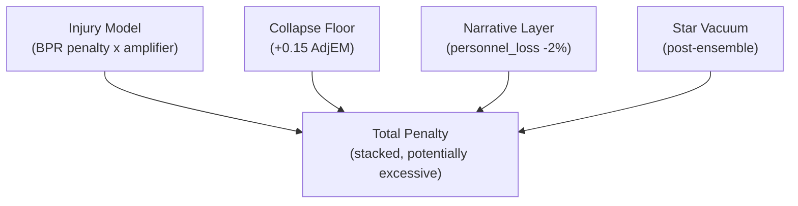

# Surgical Injury Model Improvement Plan

The goal is to make star player injuries have **real, meaningful impact** on predictions while eliminating stacking/double-counting that inflates penalties beyond reality.

---

## Problem Diagnosis

Currently, a player like C. Wilson (UNC) gets penalized through **four overlapping mechanisms**:

The fix: create a **single coherent penalty path** where each mechanism has a clear, non-overlapping role.

---

## Change 1: Fix Double-Counting (Narrative x Injury Overlap)

**Current state:** `NARRATIVE_INJURY_OVERLAP_DISCOUNT = 1.00` in [src/weights.py](src/weights.py) means `personnel_loss` narratives are already fully eliminated when the injury model is active. This is correct.

**Action:** Verify this is working as expected. If `personnel_loss` entries in [data/narratives.csv](data/narratives.csv) are still being applied despite the discount, fix the application logic in [src/narrative_layer.py](src/narrative_layer.py). If it's working (discount = 1.00 = fully removed), no code change needed — just confirm.

---

## Change 2: Dial Back Multi-Category Amplifier

**Current values** in [src/injury_model.py](src/injury_model.py) (lines 78-81):

- 2 cats: 1.25x, 3 cats: 1.50x, 4 cats: 1.75x, 5+ cats: 2.00x

**Recommended new values:**

- 2 cats: **1.15x** (minor two-dimensional loss)
- 3 cats: **1.30x** (system hub — meaningful but not extreme)
- 4 cats: **1.45x** (team identity loss)
- 5+ cats: **1.60x** (complete collapse, capped)

**Rationale:** The current 2.00x for 5+ categories literally doubles the penalty. Combined with star carrier vacuum (post-ensemble), this can create AdjEM hits of 3-4+ points for a single player, which is historically unsupported. The 8 MASH Unit cases in [src/residual_validation.py](src/residual_validation.py) show actual injury impacts in the 1-3 AdjEM range for even the most devastating losses. The new curve (1.15 to 1.60) keeps the signal meaningful while staying within historical bounds.

---

## Change 3: Modify Collapse-Risk Floor

**Current:** +0.15 AdjEM floor for players with 3+ cats AND 20%+ BPR share.

**Recommendation:** Raise the threshold to **4+ categories** (stronger signal required) and reduce the floor to **+0.10 AdjEM**. Players who lead only 3 categories are common (many top players do); 4+ is a much stronger signal of true system dependency.

**Files:** [src/injury_model.py](src/injury_model.py) constants at lines 87-89:

- `COLLAPSE_CATS_THRESHOLD`: 3 -> **4**
- `COLLAPSE_ADDITIONAL_PENALTY`: 0.15 -> **0.10**

---

## Change 4: Cap Single-Player Maximum Penalty

Add a per-player penalty cap to prevent any single injury from moving the needle more than a historical maximum.

**Recommended cap:** `MAX_SINGLE_PLAYER_PENALTY = 0.35` (raw penalty before AdjEM scaling). Based on the MASH Unit cases, the worst historical single-player losses (2012 UNC/K. Marshall, 2022 Houston/Sasser) produced ~2-3 AdjEM effective impact. With the 5.5x scaling factor used in degradation, 0.35 raw -> ~1.9 AdjEM, which is in the right ballpark.

**Location:** Apply in [src/injury_model.py](src/injury_model.py), right after the amplifier is applied (around line 360), as `ip.penalty = min(ip.penalty, MAX_SINGLE_PLAYER_PENALTY)`.

---

## Change 5: Narrative Layer — Keep Supplementary, Expand Carefully

**Current state:** 31 entries in [data/narratives.csv](data/narratives.csv), capped at 5% per team.

**Action:**

- Keep the 5% cap — narratives should never dominate the model
- Confirm `personnel_loss` entries are fully discounted (Change 1)
- Optionally add 2-3 new narrative entries for coaching matchup edges or rivalry factors the user identifies, but keep magnitudes at 0.01-0.015 (low influence)
- No structural code changes needed in [src/narrative_layer.py](src/narrative_layer.py)

---

## Change 6: XGBoost Feature Question

**Answer to the user's question:** We do NOT have historical injury data in the archives. The `injuries.csv` is 2026-only. The `EvanMiya_Players.csv` is also 2026-only. So we **cannot** add injury features to XGBoost training (no historical ground truth).

However, we DO have historical niche features (consistency, scoring_margin_std are already included). Recency features (form_trend) could theoretically be computed from historical game logs, but that's a larger change outside surgical scope.

**Recommendation:** Keep XGBoost on base stats only for now. This is cleaner and avoids introducing features that only exist for 2026.

---

## Change 7: Wire Social Validation as Diagnostic

**Recommendation:** Wire [src/social_validation.py](src/social_validation.py) into [src/main.py](src/main.py) as a **diagnostic-only** section appended to `full_report.txt`. It should:

- Run after Monte Carlo
- Print CONFIRMED / BLIND_SPOT / CONTRARIAN tiers
- NOT touch any probabilities

This gives the user a "sanity check" layer without introducing model risk.

---

## Change 8: Quick Backtest (2022-2025)

Run the existing MASH Unit backtest in [src/residual_validation.py](src/residual_validation.py) against the 8 historical cases to verify the new amplifier values produce penalties in the historically observed range. Print a before/after comparison:

| Case | Old Penalty | New Penalty | Actual Impact |
| ---- | ----------- | ----------- | ------------- |

This validates that the dialed-back amplifiers still capture real injury effects without overshooting.

---

## Change Summary

| #   | What                                       | Where                           | Risk                |
| --- | ------------------------------------------ | ------------------------------- | ------------------- |
| 1   | Verify narrative overlap discount          | weights.py / narrative_layer.py | None (verification) |
| 2   | Dial back amplifiers (1.15/1.30/1.45/1.60) | injury_model.py lines 78-81     | Low                 |
| 3   | Collapse floor: 4+ cats, +0.10             | injury_model.py lines 87-89     | Low                 |
| 4   | Add per-player penalty cap (0.35)          | injury_model.py ~line 360       | Low                 |
| 5   | Narrative: keep supplementary              | narratives.csv (optional adds)  | None                |
| 6   | XGBoost: no change (no historical data)    | —                               | None                |
| 7   | Wire social validation (diagnostic)        | main.py + dashboard.py          | Low                 |
| 8   | Quick MASH Unit backtest                   | residual_validation.py          | None (read-only)    |

---

## Expected Outcomes

- **UNC (C. Wilson):** Penalty should settle around **-0.8 to -1.0 AdjEM** (down from -1.3, up from old -0.6). This is more historically grounded.
- **Texas Tech (C. Anderson, 5 cats):** Penalty capped at reasonable level instead of 2.00x explosion.
- **No double-counting:** Narrative `personnel_loss` fully eliminated when injury model handles the player.
- **Validated:** MASH Unit backtest confirms new penalties align with historical reality.

